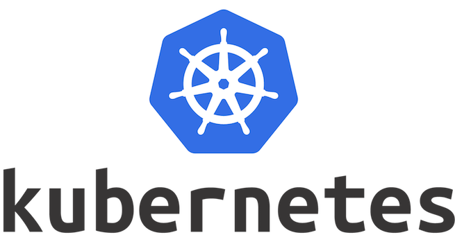

# 從異世界歸來的第一天 - Kubernetes 啟航

## 前言

這是一個異世界歸來後發現好像只剩自己不會 `Kubertnetes` 的故事，一切都一個死文組踏入前後端並且在愚昧山丘待了一年多開始說起。

一開始對於小白時期的我，寫寫 API 串串資料讓畫面可以互動起來，就已經滿足我對網路世界的想像，那時候對於容器化的概念也只停在工作上已經有現成的會啟動會用就好、不知道還可以拿來做什麼的地步，直到接觸了 `Golang` 與 `Node` 這等適合拿來做微服務的語言，接觸到微服務概念的我彷彿就像大夢初醒一樣，瞬間將我從異世界拉回現實，它是一種軟體架構風格，以專注於特定功能切分成各種服務，並且以組合的方式建構出複雜的大型應用。

為了管理如此龐大複雜的應用，需要輕便、彈性、有效率的容器化技術來管理這些服務，這時候 `Kubernetes` 在 2015 年橫空出世帶來爆炸式的創新，提供了一個可以共同佈署維護並擴充的機制，不但有效的降低耦合並且可延伸滿足不同的工作負載，雖然我不是數學家，但這真的深深地另我著迷！

## 目錄

接下來的日子裡，我將依自己的學習經驗為大夥由淺到稍微不淺的了解 `Kubernetes` ，有興趣的同學可以先參考參考。

### 概念篇：萬丈高樓平地起，開始爬吧！

- 從異世界歸來的第二天 - Kubernetes 是什麼
- 從異世界歸來的第三天 - Kubernetes 的組件

### 安裝篇：一定要先安裝些什麼吧～

- 從異世界歸來的第四天 - Kubernetes 本地集群安裝 (docker desktop for mac)
- 從異世界歸來的第五天 - Kubernetes Dashboard 你的 Kubernetes GUI 神器

### 基礎篇：老闆總說先可以 Run 就好，其他之後再說…

- 從異世界歸來的第六天 - Kubernetes 三兄弟 - Pod (一)
- 從異世界歸來的第七天 - Kubernetes 三兄弟 - Service (二)
- 從異世界歸來的第八天 - Kubernetes 三兄弟 - Deployment (三)
- 從異世界歸來的第九天 - Kubernetes 三兄弟 - Pod 的生命週期 (四)
- 從異世界歸來的第十天 - Kubernetes 老大哥 - Ingress
- 從異世界歸來的第十一天 - Kubernetes Kubectl 指令與他的小抄們

### 主題篇 (Volume)：相較之下 Docker Volume 好像遜色了點？

- 從異世界歸來的第十二天 - Kubernetes Volume (一) 是什麼
- 從異世界歸來的第十三天 - Kubernetes Volume (二) - EmptyDir
- 從異世界歸來的第十四天 - Kubernetes Volume (三) - ConfigMap
- 從異世界歸來的第十五天 - Kubernetes Volume (四) - Secret
- 從異世界歸來的第十六天 - Kubernetes Volumes (五) - PV & PVC

### 主題篇 (Resources)：資源監控一定是全新的世界

- 從異世界歸來的第十七天 - Kubernetes Resources(一) - Request/Limit
- 從異世界歸來的第十八天 - Kubernetes Resources(二) - Namespace
- 從異世界歸來的第十九天 - Kubernetes Resources(三) - LimitRange
- 從異世界歸來的第二十天 - Kubernetes Resources(四) - Metrics-Server

### 主題篇 (AutoScaling)：身為 Server 守護者的你是不是也沒辦法睡個好覺

- 從異世界歸來的第二一天 - Kubernetes AutoScaling (一) 是什麼
- 從異世界歸來的第二二天 - Kubernetes AutoScaling(二) - Horizontal Pod Autoscaler
- 從異世界歸來的第二三天 - Kubernetes Autoscaling (三) - Vertical Pod  Autoscaler

## 結論

開賽第一天先預祝各位勇敢的水手們啟程順利， 緊握 `Kubernetes` 象徵性的船舵一帆風順，再次強調此次鐵人賽志在參加，希望自己能在自己努力過的領域中留下一抹痕跡，文中絕大部分都是網路上的巨人前輩們的結晶加上自己的一些理解，任何有誤歡迎提出來討論，但有任何不喜絕對不要噴我XD，請默默關掉視窗，小弟很脆弱承受不起任何謾罵。好了，免責聲明已出就讓我們在接下來日子一起努力吧。