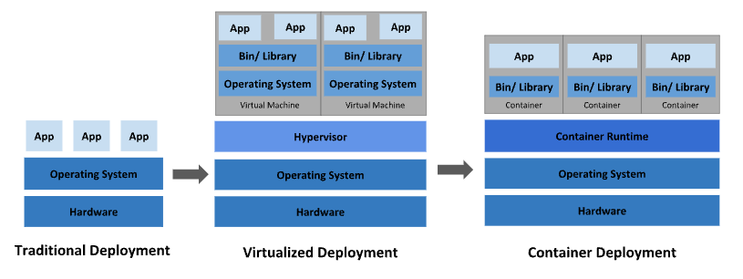

# 從異世界歸來的第二天 - Kubernetes 是什麼？

## 概述

從今天開始我們就要對 `Kubernetes` 有個初步的了解，俗話說有好的開始就是成功的一半，相信大家再接觸一個新領域時內心多少會有點痛苦跟懼怕，但經過了解彼此後發現 `Kubernetes` 並沒有我當初幻想的那麼艱深那麼遙不可及，反而就像免治馬桶一樣，用過就回不去了 XD。

`Kubernetes` 是一個相對進階的容器化應用，需要有一點點容器化基礎，這裡可以簡單理解成只要玩過 Docker 一小陣子的同學應該都可以很快的理解其中奧妙，所以我們將從基礎概念開始闡述 `Kubernetes` 並且開始由粗至細的去了解它的各個元件。

# Kubernetes 是什麼

`Kubernetes` 是一個可移植、可擴展的開源平台，用於管理容器化的工作負載和服務，可促進聲明式配置和自動化。`Kubernetes` 擁有一個龐大且快速增長的生態，其服務、支持和工具的使用範圍相當廣泛。

`Kubernetes` 這個名字起源於希臘文，意思為 “舵手” 或是 “飛行員”，最初是由 Google 的工程師們設計開發並且在 2014 年首次對外宣布，`Kubernetes` v1.0 於 2015 年 7 月 21 日釋出並且 Google 與 Linux 基金會合作組建了 `Cloud Native Computeing Foundation (CNCF)` 來， 有趣的是官方證實了一個都市傳說就是 `k8s` 這個縮寫是因為 k 跟 s 之間有八個英文字符的關係。

# 網路部署的演變

## 1. 傳統部署時代

早期的應用程式多半是在物理伺服器上建構而成，由於無法限制物理伺服器中運行的應用程式資源使用，因此產生資源分配的問題，而在早期的解決方案就是將每個應用程式都分別運行在不同的物理伺服器上，除了物理伺服器高昂的維護成本之外，也產生了一個問題就是當某個伺服器資源使用率不高時，剩餘資源無法分配給其他應用程式，看到上述問題的痛點是不是也有感而發的想到那為何不在同一台物理伺服器上使用虛擬隔離呢，於是前人們就在這個問題點上造就了下個時代的技術演進。

## 2. 虛擬化部署時代

因此，虛擬化技術漸漸被引入，虛擬化技術允許在單個物理單位的伺服器上運作多個虛擬環境 (VM) ，使各種應用程式在不同的 VM 之間被安全的彼此隔離。虛擬化技術使物理伺服器可以更有效地利用資源或更新應用程式，因此具有更高的可伸縮性，以及降低硬件成本的好處。

而我們從上圖可以發現每個 VM 都是一個完整的操作系統，每次開啟都需要建立一個完整的系統環境才能開始運行，同樣也會造就啟用的服務不需要用到全部的資源造成資源浪費，看到這裡我們又可以很合理的聯想到現代開發離不開的容器化技術，像是 Docker、以及本系列介紹的 kubenetes。

## 3. **容器部署時代**

容器類似算 VM，但是具有更寬鬆的隔離特性，各個容器之間可以共享操作系統，只需要安裝自己需要用的應用程式即可，可以避免不需要的資源浪費，達到更輕量的概念但同時每個容器可以擁有自己的文件系統、CPU、內存、進程空間等。

容器為現代開發的趨勢。以下為容器化的一些好處：

- 快速的應用程式啟動以及敏捷的部屬：通過鏡像的不可變性，提供簡單的 Rollback 以及容器建構部屬。
- 跨開發、測試和生產以及跨系統的一致性：在不同的設備上也可以擁有一致環境的應用程式。
- 提高抽象級別並且鬆散耦合、分佈式的微服務：將應用程式分解成更小的單位，並且動態部屬合管理，而不是在單體式架構下運行。
- 資源隔離：可預測的效能表現。
- 資源利用：高效率高密度。

# Kubernetes 能為你做些什麼？

在容器盛行的時代下，有許多人早已把容器化技術當做部署策略，而我們需要管理並且確保應用程式容器狀態，確保服務不中斷。這時 Kubenetes 挾帶容器技術敏捷部屬以及快速建構的優點提供了一個可彈性運行分佈式系統的框架，在 Kubenetes 中可以統一使用設定檔滿足需要的擴展需求、故轉移、自動部屬、滾動更新以及回滾等並且加以監控偵測，由程式面處理平台層的所有操作，甚至是更進一步實現 `Infrastructure as Code`。

# 結論

想到當初將應用程式打包成容器並且在雲端服務上使用 Docker 成功運作起來的成就感，不經感嘆：天啊雲端加 Docker 太方便了！，但這種心得在我知道這世上存在著 Kubenetes 這種更宏觀的容器化技術以及他的存在是要解決更實際的生產環境問題後，讓我知道自己還有很多不足的地方以及還有更多需要學習，希望可以藉由本次參賽經驗提升自己對容器技術的了解。