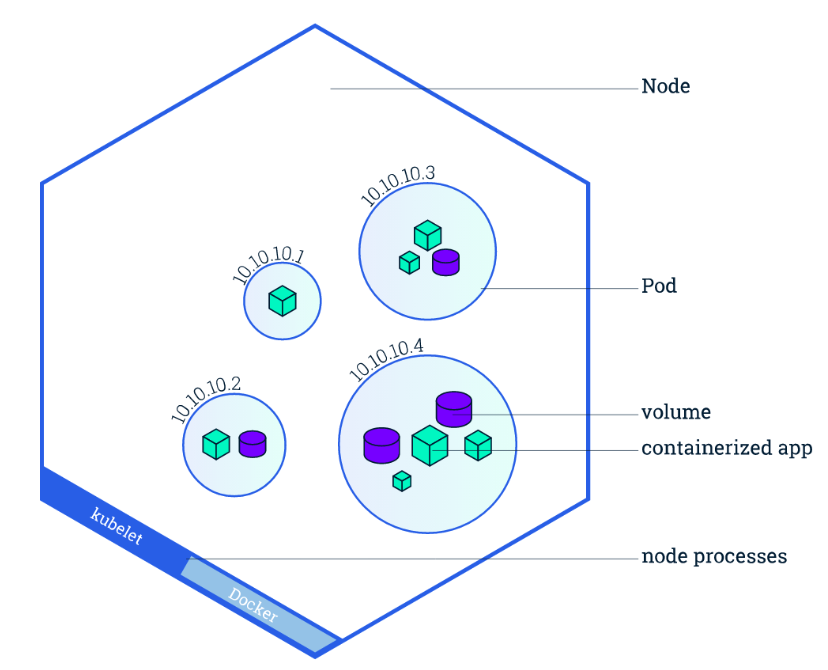
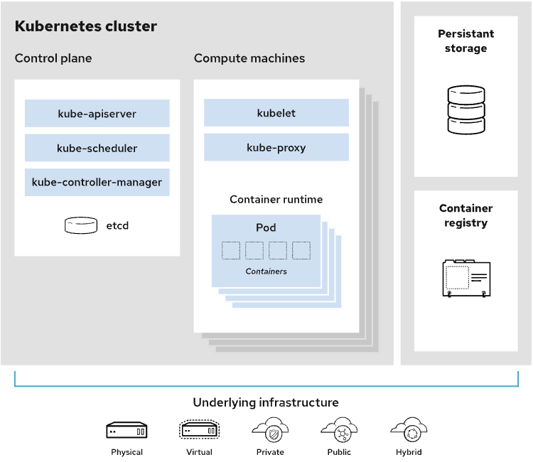

# 從異世界歸來的第三天 - Kubernetes 的組件

## 概述

看過上一篇的 `Kubernetes` 介紹，可以知道它是用於大規模運行分佈式應用和服務的開源容器編排平台，在背後必須有一個穩固的結構來支持其運行，今天就更深入的看看組成 `Kubernetes` 的幾個大組件。

## Kubernetes 設計原理

正如[Kubernetes 實施細節](https://kubernetes.io/docs/reference/setup-tools/kubeadm/implementation-details/)中所述，Kubernetes 集群的設計基於3 個原則。

Kubernetes 集群應做到：

- **安全。**

  它應遵循最新的安全最佳實踐。

- **易於使用。**

  它應能通過一些簡單的命令進行操作。

- **可擴展。**

  不應偏向於某一個提供商，而是能通過配置文件進行自定義。

## Kubernetes 集群中包含哪些組件

當你部屬完 Kubernetes 時，便「至少」擁有了一個完整的集群（可以依照需求擴展集群），而每個集群裡都會有個 `主節點（Master Node）`作為控制整個集群容器溝通並且分派任務的 `控制平面組件（Control Plane Components)` ，以及至少一個 `工作節點（Worker Node）` 拖管所謂的 `Pod` ，也就是我們的作為應用負載的組件。

## **Kubernetes 工作節點中會發生什麼？**

### Node 節點

Node 是 Pod 真正運行的主機，是 「Kubernetes 中最小的主機單位」，可以是物理機也可以是虛擬機，而集群上的所有 Pod 將會被下面提到的 kube scheduler 分派到最合適的 Nodes 中。為了管理Pod，每個Node 節點上至少要運行container runtime（比如docker）、`kubelet`和 `kube-proxy` 服務。

### Pod 容器集

Pod 是 Kubernetes 對象模型中最小、最基礎的單元。它代表了應用的單個實例。每個 Pod 都是由一個或一個以上的容器（可以理解成一個或多個 docker image）以及若干控制器的組成。 Pod 跟 Docker 一樣支持持久存儲（volume），以運行有狀態應用。

## **Container runtime engine 容器運行引擎**

為了運行容器，每個 Node 都會有個容器運行引擎，像是 Docker ，但Kubernetes 也支持其他符合開源容器運動（OCI）標準的運行時，例如rkt 和CRI-O。

### **Kubelet**

每個計算節點中都包含一個kubelet，這是一個與控制平面通信的微型應用。kublet 可確保容器在容器集內運行。當控制平面需要在節點中執行某個操作時，kubelet 就會執行該操作。

### Kube-proxy

每個 Node 中還包含kube-proxy，這是一個用於優化Kubernetes 網絡服務的網絡代理。kube-proxy 負責處理集群內部或外部的網絡通信，靠操作系統的數據包過濾層，或者自行轉發流量。可以簡單的理解為負責為 Service 提供集群內部的服務發現和負載均衡。

## **Kubernetes 控制平面中會發生什麼？**

### Control Plane 控制平面

就讓我們從 Kubernetes 集群的中樞神經開始說起，在這裡我們可以找到控制集群的 Kubenetes 組件以及一些有關集群狀態和配置的數據。這些核心 Kubernertes 組件負責處理重要的工作，以確保容器能以足夠的數量和所需的資源運行。

控制平面會一直跟我們的本機保持連線，且以被設定為核心方式運行，所以一般情況不需特別對其作設定。

### kube-apiserver

在一開始使用 Kubernetes 工具時，一定會下載其指令命令工具 `kubectl` 來進行對集群的各種操作（後面將會開始進入環境安裝），我們熟悉的 `kubectl` 就是在跟我們的 `控制平面` 各種溝通，而 API 服務器就是整個 Kubernetes 控制平面的前端，該組件可以使用 `REST 調用` 還有前面提到的 `kubectl指令` ，其主要工作是負責公開 Kubernete API 且接受並處理請求的工作。

### **kube-scheduler**

簡單來說 kube scheduler 就是一個容器調度器，負責把新建立的 Pod 分派到最合適的 `Woker Node` 上。在這個過程物中，kube scheduler 會監控所有被這個集群管理的 worker nodes，並且依據使用者訂立的 `Filtering` 跟 `Scoring Policy` 設定去選擇最理想的 worker node。

### **kube-controller-manager**

控制器負責實際運行集群，而 kube controller manager 控制器則是將多個控制器功能合而為一。控制器用於查詢調度程式，並確保有正確數量的 Pods 在運行。如果有 Pods 停止運行，另一個控制器會發現並做出響應。這些控制器能將服務連接到 Pods ，以便讓請求前往正確的端口。

### **etcd**

有關集群狀態已經集群相關配置設定位於 etcd，以便集群 crash 後的迅速還原當前狀態。

## 結論

在簡單的理解 Kubernetes 的結構後，可能對於其實際運用的概念還是一片茫然，但隨著日後的實戰演練後，會有很多機會回頭反覆驗證這個結構以及背後通訊的機制，然後漸漸內化成自己的理解，接下來我們將要實際操作 Kubernetes ，開始親身體會它的靈活性以及自由度。

Reference from

- **[Kubernetes 架構簡介](https://www.redhat.com/zh/topics/containers/kubernetes-architecture)**
- ****[Kubernetes Components](https://kubernetes.io/docs/concepts/overview/components/)****
- **[[Kubernetes] Cluster Architecture](https://godleon.github.io/blog/Kubernetes/k8s-CoreConcept-Cluster-Architecture/)**
- ****[Kubernetes 基本概念](https://kubernetes.feisky.xyz/introduction/concepts)****