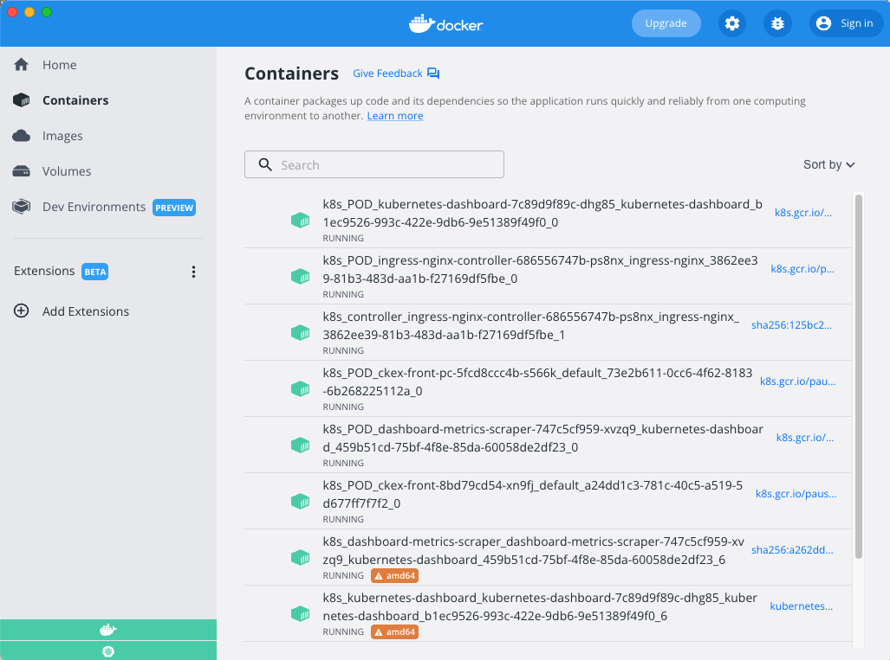
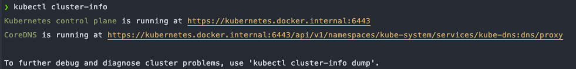

# Day4 Kubernetes 本地集群安裝 (docker desktop for mac)

## 概述

市面上有好幾種非常方便可以讓開發者在本機輕易架設一個 Kubernetes 集群 的工具，以下將會以 Docker Desktop 內建 Kubernetes 進行整個系列的安裝教學以及日後文章的本地操作。
眾所皆知 Kubernetes 的更新速度以及 API 棄用速度都是相當的快，大概每個三個月就一次小更新，常常在網路上看到一年前左右的教學可能就已經沒辦法開箱及用了，常常需要獨自翻閱最新的 API 文件甚至直接爬源碼來轉換，希望本次帶來的分享不只是手把手的教學而是一通百通的觀念。以下內容版本皆在 Docker Desktop 4.8.1 (78998) 中 Kubernetes v1.24.0的 MAC 環境下建立。
### 下載 Docker Desktop (macOS)

1. 官方載點：[https://dockerdocs.cn/docker-for-mac/install/#google_vignette](https://dockerdocs.cn/docker-for-mac/install/#google_vignette)
2. 將 docker.dmg 拖曳至 Application。


3. 點開 [docker.app](http://docker.app) ，看到初始介面就是安裝成功了。


### 開啟 docker desktop 中內建的 Kubernetes

1. 點擊右上角 setting 選項我們可以找到 `Kubernetes` 相關設定，這點選 `Enable Kubernetes` 並按下 `Apply & Restart` 會花一小段時間在安裝 Kubernetes 所需的相關 image。


2. 經過一段時間的等待沒有意外的話可以在我們的 Docker Desktop GUI 上看到 Kubernetes 服務量起了綠燈，以及 Kubernetes 相關的容器也都順利的被啟動了。



### 查看 Local Kubernetes 狀態

1. 取得集群資訊

```bash
kubectl cluster-info
```



2. 查看 Nodes

```bash
kubectl get nodes
```


3. 查看版本

```bash
kubectl version --short
--------
Flag --short has been deprecated, and will be removed in the future. The --short output will become the default.
Client Version: v1.24.3
Kustomize Version: v4.5.4
Server Version: v1.24.0
```
## 結論

在前幾天的初步了解後，我們將要開始踏入 kubernetes 的世界，在這邊也不禁的感慨起現在的後端在現在已經很難以將精力完全放在寫程式上，為了處理好一件事情可以會用到不同的後端語言，每個語言又有各自的 Web Framwork 或  API Framwork，同時還可能會用上各種類型的資料庫，無論是關聯式非關聯式又或者是快取型的資料庫。此外為了可以承受更大規模的使用量，我們又必須要使用上負載均衡、自動擴展以及資料庫主從分離等架構上的技術觀念，管理這些服務伺服器時我們不能單單的使用 docker 容器化就能解決這些的需求，我們需要擁有一層更上層的平台容器管理層來幫我們把這件事情變得輕鬆，而這就是我們需要學習 Kubenetes 的原因。

Reference from

****[在Mac上安装Docker Desktop](https://dockerdocs.cn/docker-for-mac/install/#google_vignette)****

****[Local Kubernetes for Mac– MiniKube vs Docker Desktop](https://codefresh.io/blog/local-kubernetes-mac-minikube-vs-docker-desktop/)****

****[Docker Desktop for Mac/Windows 开启 Kubernetes](https://github.com/AliyunContainerService/k8s-for-docker-desktop)****