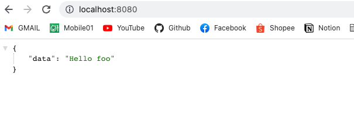
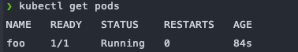
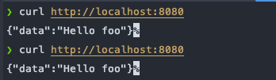

# Day 6 Kubernetes 三兄弟 - Pod (一)

## 概述

在實作練習 Kubernetes 時，在實現那些進階的操作像是負載均衡、滾動更新、安全與監控…等概念，我們都會不斷不斷的圍繞在 `Kubernetes 三兄弟 - Pod, Service, Deployment` 身邊不斷的為其設定，來實現以上操作，所以接下來我們將會對這三兄弟 (一鄉情願的自稱？) 來點初步的了解。

首先要來介紹的是 `Pod` ，在我們前幾天的 `Kubernetes 組件` 介紹文章中也有提到，Pod 是 Node(節點) 中最小的單位，等於我們所使用的容器們都會被放置 Pod 裡管理。通常一個 Pod 裡只會有一個容器( `也可以有一個以上的容器`)，接下來我們將會實作一個簡單的容器來練習。

## 建立容器 (Container)

基本上只要是 Container-based 的服務，都可以拿來讓 Kubernetes Pod 佈署，而不僅限於 Docker Container，只是因為現代容器趨勢依舊是被 Docker 掌握著加上其方便性以及穩定性，所以我們將會使用 Docker 處理各種容器建構。

### Golang 簡單程式碼

來寫一個簡單的 API ：

```bash
package main

import (
	"github.com/gin-gonic/gin"
	"net/http"
)

func main() {
	router := gin.Default()
	router.GET("/", func(c *gin.Context) {
		c.JSON(http.StatusOK, gin.H{"data": "Hello foo"})
	})
	router.Run()
}
```

此為一個點開 [localhost:8080](http://localhost:8080) 即可出現 `Hello foo` 字樣的簡易 API Server。

### Dockerfile 設定檔

```bash
FROM golang:1.18-rc-alpine as builder

WORKDIR /

COPY . .

RUN go mod tidy

RUN go build -o main

// 多階段建構
FROM alpine:3.15.0-rc.4

WORKDIR /

COPY --from=builder /main .

EXPOSE 8080

ENTRYPOINT ["./main"]
```

以上就是我們簡單產生出一個 docker image 的設定檔，接下來我們就可以用他來建構一個 Container image。

```bash
docker build -t foo . 
```

來 run 一下看看

```bash
docker run --rm -p 8080:8080 -it -d foo
```



成功出現 `Hello foo` ~

## 將 Image Push 到 Container Registry

當我們把 Image 推送到遠端的 Image 存取服務的倉庫時，我們就可以使用 Image 與 tag 拉下我們想使用的指定 Image，這也是容器化的其中一個便利性，當然 Kubernetes 也是採用一樣的方式來取得要運作的容器服務。

### 推上 Docker Hub

```bash
docker build -t mikehsu0618/foo . 

docker push mikehsu0618/foo
```

這裡簡單的將 docker image 推到我個人的 docker hub 庫中，docker 相關操作就不稍贅述，如需練習可以直接拉取這裡已經建理好的 Image 即可。

## 建立 Pod 設定檔

```bash
// pod.yaml
apiVersion: v1
kind: Pod
metadata:
  name: foo
  labels:
    app: foo
spec:
  containers:
    - name: foo
      image: mikehsu0618/foo
      ports:
        - containerPort: 8080
```

- apiVersion : 代表目前該元件在 Kubernetes 中的版本號。
- metadata
    - [metadata.name](http://metadata.name) : 表示這個 Pod 的名稱
    - metadata.labels : `Lables 標籤` 是附加到 Kubernetes 對象 ( 例如 Pods, Service, Deployment) 上的 Key-Value 組合。旨在用於把對用戶有意義且相關的對象分組，但不直接對核心系統有直接關聯，如此一來，我們即可使用 `選擇器(Selector)` 選取指定 Lables 運作。
- spec : 在 spec 我們可以看到在 Docker 很熟悉的 Image 設定配置，此處可以用來設定一個或多個 Container。
- [containers.name](http://containers.name) : 設定 Container 名稱。
- containers.image : Image 的路徑，此處為 Docker Hub 的拉取路徑。
- containers.ports : `containerPort` 代表的是這個 Container 只能開放哪些 port 來允許外部資源的存取。所以這邊根據我們的應用程式以及 dockerfile 設定的 8080 port 來指定 `8080` 端口。

## 在 Kubernetes 中建立 Pod

通常在 Kubernetes 基本上所有指令的建立都可以使用兩種指令：

```bash
// 建立 Kubernetes
kubectl apply -f pod.yaml
// or
kubectl create -f pod.yaml
```

以上兩個指令都可以用來建立資源，差別在於 `create` 只能用來創建還未存在的資源，而 `apply` 可以資源在已經存在的情況下，查看設定是否有異動並且更新。

接著查看 Pods 列表：

```bash
kubectl get pods
```



並且可以查看 Pod 更詳細的資訊:

```bash
kubectl describe pod foo

=========================
foo:
    Container ID:   docker://fc02b6801a4b6c62cb0aed77f4480bb41f297476c034a0d75fa079ea7e883cb4
    Image:          mikehsu0618/foo
    Image ID:       docker-pullable://mikehsu0618/foo@sha256:41cd860bd4c9ce86271bb5c864599bb2ca32b3c3a377afb12d2142fa12a87b1d
    Port:           8080/TCP
    Host Port:      0/TCP
    State:          Running
      Started:      Tue, 21 Jun 2022 17:13:30 +0800
    Ready:          True
    Restart Count:  0
    Environment:    <none>
    Mounts:
      /var/run/secrets/kubernetes.io/serviceaccount from kube-api-access-v84zl (ro)
Conditions:
  Type              Status
  Initialized       True 
  Ready             True 
  ContainersReady   True 
  PodScheduled      True 
Volumes:
  kube-api-access-v84zl:
    Type:                    Projected (a volume that contains injected data from multiple sources)
    TokenExpirationSeconds:  3607
    ConfigMapName:           kube-root-ca.crt
    ConfigMapOptional:       <nil>
    DownwardAPI:             true
QoS Class:                   BestEffort
Node-Selectors:              <none>
Tolerations:                 node.kubernetes.io/not-ready:NoExecute op=Exists for 300s
                             node.kubernetes.io/unreachable:NoExecute op=Exists for 300s
Events:
  Type    Reason     Age    From               Message
  ----    ------     ----   ----               -------
  Normal  Scheduled  2m37s  default-scheduler  Successfully assigned default/foo to docker-desktop
  Normal  Pulling    2m37s  kubelet            Pulling image "mikehsu0618/foo"
  Normal  Pulled     2m33s  kubelet            Successfully pulled image "mikehsu0618/foo" in 3.777043918s
  Normal  Created    2m33s  kubelet            Created container foo
  Normal  Started    2m32s  kubelet            Started container foo

```

### 使用 kubectl port-forward 與 Local 端接軌

來看一下 `kubectl port-forward` 指令：

```bash
kubectl port-forward TYPE/NAME [options] [LOCAL_PORT:]REMOTE_PORT
```

`port-forward` 可以使我們本地的端口轉發到指定的 Kubernetes 集群端口中，這麼一來我們就可以用本地的 [localhost](http://localhost) 去映射到我們建立起來的 Kubernetes 服務中了。

於是我們讓啟動的 Pod 的 `8080端口` 轉發到本地的 `8080端口`：

```bash
kubectl port-forward pod/foo 8080:8080

// 執行後
=======================================
Forwarding from 127.0.0.1:8080 -> 808080
Forwarding from [::1]:8080 -> 8080
```

沒意外的話我們使用 curl 去存取 `[localhost:8080](http://localhost:8080)` 可以得到一樣的回覆



## 結論

如此一來我們已經使用了 Kubernetes 運行了第一個容器了囉，到後面隨著使用情境的複雜化，要處理的問題也會越來越難，但所有的操作不外乎完全圍繞在 Pods 身上，可以說是非常核心的觀念，在初期也是會不斷的與之接觸。不難發現，我們用 Kubernetes 模擬了日常 Docker 流的一個 Container 使用方式，相信平常就有在用 Docker 的人會感到非常親切，可以說 Docker 是容器化技術的入門磚也不過分。