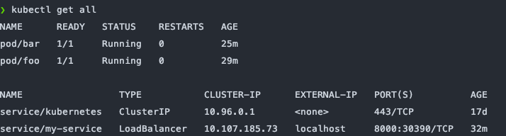
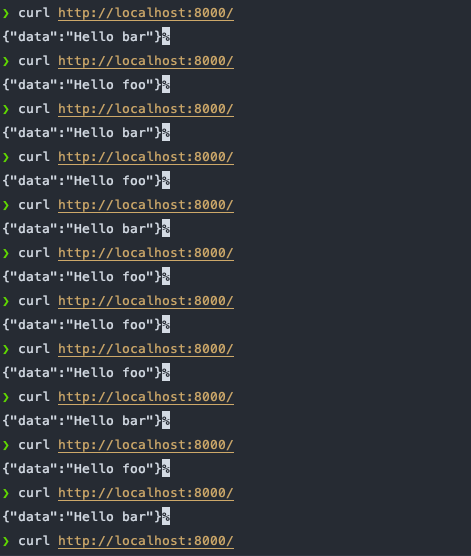

# Day7 Kubernetes 三兄弟 - Service (二)

## 概述

還記得上一篇文章我們使用 `port-forward` 實現將本地的接口轉發到 Kubernetes 中指定的 Pod 操作嗎？而 `Service` 元件就是 Kubernetes 特地為了用來定義『一群 Pod 要如何被連線及存取』 的元件，此舉不只將暴露端口的任務解耦抽象出來，更利用 `Labels` 和 `Seletor` 來識別需要套用該設定這些屬於非永久資源的 Pods，如此一來，當 Pod 被動態的創建或銷毀時，相較於直接使用 `port-forward` 的 Pod 將會失去他的暴露端口，而新創建出來的 Pod 會因為具有原來的 `Labels` 而繼續套用我們先前暴露端口的相關設定。

## 使用 Service 實現 LoadBalance

就讓我們來由把昨天 `foo` 再新增一個夥伴 `bar` ，並且使用 Service 來實作看看如何管理這兩個一群 Pod 吧：

```yaml
// pod.yaml

apiVersion: v1
kind: Pod
metadata:
  name: foo
  labels:
    app: foo
    type: demo
spec:
  containers:
    - name: foo
      image: mikehsu0618/foo
      ports:
        - containerPort: 8080
---
apiVersion: v1
kind: Pod
metadata:
  name: bar
  labels:
    app: bar
    type: demo
spec:
  containers:
    - name: bar
      image: mikehsu0618/bar
      ports:
        - containerPort: 8080
```

撰寫 Service 設定 ：

```yaml
// service.yaml
apiVersion: v1
kind: Service
metadata:
  name: my-service
spec:
  selector:
    type: demo
  type: LoadBalancer
  ports:
    - protocol: TCP
      port: 8000
      targetPort: 8080
      nodePort: 30390
```

- **apiVersion :** `Service`使用的Kubernetes API是`v1`版本號
- **[metadata.name](http://metadata.name) :** 該Service的名稱。
- **spec.type :** 可以指定Service的型別，可以是`NodePort`或是`LoadBalancer`
- **spec.ports.port :** 可以指定，創建的Service的Cluster IP，是哪個port number去對應到`targetPort` 。
- **spec.ports.nodePort :** 可以指定`Node物件`是哪一個port number，去對應到`targetPort`，若是在Service的設定檔中沒有指定的話，Kubernetes會隨機幫我們選一個port number。
- **spec.ports.targetPort :** targetPort是我們指定的 Pod 的 port number，由於我們會在Pod中運行一個port number 8080 的 container (foo & bar)，所以我們指定`hello-service`的特定port number都可以導到該 container。
- **spec.ports.protocol :** 目前 Service 支援`TCP` 、 `SCTP` 與`UDP` 三種protocol，預設為`TCP` 。
- **spec.selector :** selector則會幫我們過濾，在範例中，我們創建的Service會將特定的port number收到的流量導向 `Lable 為 type=demo` 的 Pods。

### 運行 Service, Pod 設定檔

運行一下設定檔：

```bash
kubectl apply -f pod.yaml,service.yaml
```

查看服務狀態：

```bash
kubectl get services  // 查看服務
or
kubectl get all       // 查看全部元件狀態
```



由上圖可以看出我們順利的 run 起一個 `LoadBalancer` ，如果我們的Kubernetes Cluster是架在第三方雲端服務(cloud provider)，例如 [Amazon](https://aws.amazon.com/tw/ec2/) 或 [Google Cloud Platform](https://cloud.google.com/compute/docs/instances/)，我們可以透過這些 cloud provider 提供的 [LoadBalancer](https://aws.amazon.com/tw/elasticloadbalancing/) ，幫我們分配流量到每個 Node ，而我們使用 `docker-desktop` 直會預設幫我們把 `External IP` 指向到我們的 `[localhost](http://localhost)` 。

由此一來，當我們使用 `curl` 去 call 我的設定好的 `8000端口` ，Kubernetes Service 就會將我們的流量隨機分配到 `foo` `bar` 這兩個 container 中。

```bash
curl localhost:8080
```



## 結論

Kubernetes Service 讓我們非常簡單的實現管理 Pods 流量以及 LoadBalance 的功能，在以前可是需要到雲端平台一個一個設定才可以辦到，Kubernete 幫我們省下許多細節使我們可以專注在實現維運佈署的邏輯上面，但背後的觀念非常值得我們回來細細咀嚼，日後可以對 Service 的運作機制做更深入的了解。

Reference

****[Kubernetes Service 深度剖析 - 標籤對於 Service 的影響](https://tachingchen.com/tw/blog/kubernetes-service-in-detail-2/)****

****[Kubernetes Service 概念詳解](https://tachingchen.com/tw/blog/kubernetes-service/)****

**[Kubernetes 教學系列 - 如何建立 Pod](https://blog.kennycoder.io/2020/12/13/Kubernetes%E6%95%99%E5%AD%B8%E7%B3%BB%E5%88%97-%E5%A6%82%E4%BD%95%E5%BB%BA%E7%AB%8BPod/)**

**[Kubernetes Docs - Service](https://kubernetes.io/zh-cn/docs/concepts/services-networking/service/#protocol-support)**