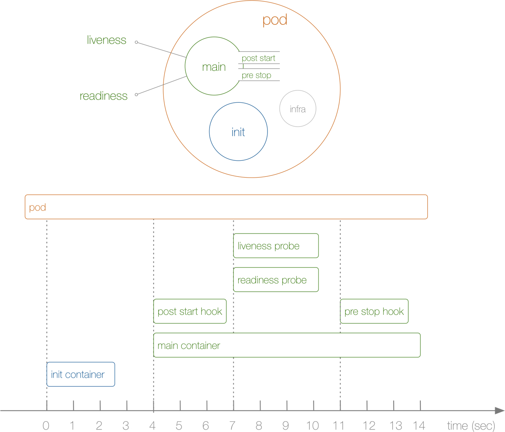

# 從異世界歸來的第九天 - Kubernetes 三兄弟 - Pod 的生命週期 (四)

## 概述

恭喜堅持到這裡的各位，走完前面幾篇實戰練習已經可以大聲的說：媽我在用 `Kubernetes` 了～，但凡事一定都不會如想像中的單純，接下來我們要正式進入進階基礎篇，帶各位了解除了最基本的基礎外以及其背後的原理。

不難發現前面提到的 `Deployment` `Service` 都是以 `Pod` 為中心去實現各種需求，由此可知 `Pod` 的重要性，通常 `Pod` 可以被視為一個服務的單位，包含著一個或一個以上的容器，能不能順利的把你的服務就靠他了，所以我們最好再一開始就可以掌握 `Pod` 的生命週期中每個不同的階段，並且使用各種方法使其保持預期的健康，像是存活/就緒探針、重啟策略等。

## Pod 的生命週期



`Pod` 的生命週期可以理解成從創建到退出的過程，在這過程中 `Pod` 將會經歷各種不同狀態的變化以及環環相扣的執行，上圖展示了一個 `Pod` 的完整生命週期過程，除了我們的`主容器(main contain)` 外還包括`初始化容器(init container)`、`生命週期鉤子(post start / pre stop hook)`、`健康檢查(liveness / readiness probe)` ，接下來我們就來分別介紹其影響 Pod 生命週期的部分，但在此之前我們需要先了解 Pod 的狀態定義，作為最頂層的狀態顯示可以簡單的反映出當前的具體狀態信息，遇到錯誤時會是第一眼分析排錯的地方。

### Pod Phase (階段)

```python
kubectl get pods
--------
NAME                            READY   STATUS              RESTARTS        AGE
admin-server                    1/1     Running             0               37h
apps                            1/1     Running             0               22d
```

這裡指的 Pod Phase 就是我們在查看 Pods 列表所用的 `kubectl get pods` 所帶出的 `STATUS` 欄位。

Pod Phase 所包含的狀態數量和定義是嚴格指定的，下面是 `phase` 可能的值：

- `Pending`：Pod 信息已經提交給了集群，但是還沒有被調度器調度到合適的節點或者Pod 裡的鏡像正在下載。
- `Running`：該Pod 已經綁定到了一個節點上，Pod 中所有的容器都已被創建。至少有一個容器正在運行，或者正處於啟動或重啟狀態。
- `Succeeded`：Pod 中的所有容器都被成功終止，並且不會再重啟。
- `Failed`：`Pod` 中的所有容器都已終止了，並且至少有一個容器是因為失敗終止。也就是說，容器以數量非零的狀態退出或者被系統終止。
- `Unknown`：因為某些原因無法取得Pod 的狀態，通常是因為與Pod 所在主機通信失敗導致的。


### 重啟策略(restartpolicy)

我們可以通過配置`spec.template.spec.restartPolicy`來設置 Pod 中所有容器的重啟策略，其可能值為`Always，OnFailure 和 Never`，默認值為`Always`。容器的應用程序發生錯誤或容器申請超出限制的資源都可能導致 Pod 終止, 此時會根據 `restartPolicy`來決定是否該重建 Pod。以下為三種可選的重啟策略：

- `Always`: Pod終止就重啟, 此為`default`設定。
- `OnFailure`: Pod發生錯誤時才重啟。
- `Never`: 從不重啟。

`restartPolicy` 僅指通過kubelet 在同一節點上重新啟動容器。通過 kubelet 重新啟動的退出容器將以指數增加延遲（10s，20s，40s…）重新啟動，上限為5 分鐘，並在成功執行10 分鐘後重置。不同類型的的控制器可以控制Pod 的重啟策略：

- `Job`：適用於一次性任務如批量計算，任務結束後 Pod 會被此類控制器清除。Job 的重啟策略只能是`"OnFailure"`或者 `"Never"`。
- `Replication Controller, ReplicaSet, or Deployment`，此類控制器希望 Pod 一直運行下去，它們的重啟策略只能是`"Always"`。
- `DaemonSet`：每個節點上啟動一個Pod，很明顯此類控制器的重啟策略也應該是`"Always"`。

```python
apiVersion: apps/v1
kind: Deployment
metadata:
  name: my-app
  labels:
    app: my-app
spec:
  serviceName: my-app
  replicas: 1
  selector:
    matchLabels:
      app: my-app
  template:
    metadata:
      labels:
        app: my-app
    spec:
      restartPolicy: Always
      containers:
      - name: my-app
        image: myregistry:443/mydomain/my-app
        imagePullPolicy: Always
```

### 初始化容器 (Init Container)

了解了 Pod 的狀態以及重啟策略後，接下來我們要看的在 Pod 生命週期中最先啟動的 `Init Container` 。顧名思義其就是用來在主程序運行之前會被運行完畢的初始程序，可以是一個或多個，如果一個以上的話，這些容器將會按照定義的順序執行。我們知道一個 Pod 裡面可以在所有容器中共享數據和 Network Namespace，所以我們可以常常可以利用初始化容器執行初始化動作使一切資源就緒時再啟動主容器，這樣有益於我們將初始化的邏輯從主容器中解藕出來，變得更加靈活用運。那麼初始化容器還有哪些應用場景呢：

- `等待其他服務就緒`：此作法可以用來解決服務之間的依賴問題，比如說我們有個主服務依賴於另一個數據庫服務，但是在我們啟動這個主服務詞我們並不能保證被依賴的數據庫是否就緒，這時候我們可以簡單使用一個 `init container` 去監測數據庫是否就緒，確認就緒後就能直接退出並且主程序將會在這時候接著啟動。
- `做初始化配置`：比如集群裡檢測所有已經存在的成員節點，為主容器準備好集群的配置信息，這樣主容器起來後就能用這個配置信息加入集群。

比如現在我們實現一個初始化容器去預先準備首頁內容：

```python
apiVersion: v1
kind: Pod
metadata:
  name: init-demo
spec:
  volumes:
  - name: workdir
    emptyDir: {}
  initContainers:
  - name: install
    image: busybox
    command:
    - wget
    - "-O"
    - "/work-dir/index.html"
    - http://www.baidu.com
    volumeMounts:
    - name: workdir
      mountPath: "/work-dir"
  containers:
  - name: nginx
    image: nginx
    ports:
    - containerPort: 80
    volumeMounts:
    - name: workdir
      mountPath: /usr/share/nginx/html
```

可以簡單的看出 `initContainers` 產生出 `index.html` 隨即退出，並且利用 `volume` 將資料夾目錄掛載到主容器中，實現初始化並共享資源的概念。

### 生命週期鉤子(Lifecircle Hook)

生命週期鉤子會於初始化容器執行完畢後，跟著主程序一起啟動，由 `kubetlet` 發起並且在容器啟動時以及容器終止之前運行，而我們可以為 Pod 中的所有容器配置生命週期鉤子。

`Kubernetes` 為我們提供了兩種鉤子函數：

- `PostStart`：這個鉤子在容器創建後立即執行。但是並不能保證鉤子將在容器入口點(ENTRYPOINT) 之前運行，因為沒有參數傳遞給處理程序。主要用於資源部署、環境準備等。不過需要注意的是如果鉤子花費太長時間以至於不能運行或者掛起，容器將不能達到running 狀態。
- `PreStop`：這個鉤子在容器終止之前立即被調用。它能阻塞進程意味著它是同步的，所以它必須在刪除容器的調用發出之前完成。主要用於優雅的關閉應用、通知其他系統等。如果鉤子在執行期間掛起，Pod 階段將停留在running 狀態並且永不會達到`failed` 狀態。

以下為設定生命週期鉤子的簡單範例：

```python
apiVersion: v1
kind: Pod
metadata:
  name: lifecycle-demo
spec:
  containers:
  - name: lifecycle-demo-container
    image: nginx
    lifecycle:
      postStart:
        exec:
          command: ["/bin/sh", "-c", "echo Hello from the postStart handler > /usr/share/message"]
      preStop:
        exec:
          command: ["/bin/sh","-c","nginx -s quit; while killall -0 nginx; do sleep 1; done"]
```

### 健康檢查(Health Check)

現在在整個主容器運行期間的生命週期中，能影響到 Pod 狀態的就屬健康檢查的這一部分。在 `Kubernetes` 中我們可以透過各種探針來確認容器是否處於正常運作的狀態，像是存活探針(liveness probe)、可讀探針(readiness probe)和啟動探針(startup probe)，如果出現異常將會透過自我檢測雨修復來避免把流量導到不健康的 Pod。

K8s支持四種用在Pod探測的處理器:

- `Exec`: 在容器內執行命命, 再根據其回傳的狀態進行診斷, 回傳`0`表示成功, 其餘皆為失敗。
- `TCPSocket`: 透過對容器上的 TCP 端口進行檢查, 其端口有打開表示成功, 否則為失敗。
- `HTTPGet`: 透過對容器 IP 地址上的指定端口發起 http GET 請求進行診斷, 如果回應狀態大於等於200且小於400, 則為成功, 其餘皆為失敗。
- `gRPC` ：從 v1.24 版本起，可以透過對容器 IP 地址上的指定端口發起 `gRPC` 請求進行診斷，這裡需要注意的使用 `gRPC` 做為 action 時需要特別指定端口。

kubelet 可以執行三種探測:

- `livenessProbe` ：顯示容器是否正常運作, 如果探測失敗`kubelet`會終止容器, 容器會依照重啟策略進行下一個動作。如果容器不支援存活性探測, 則默認狀態為 `Success`
- `readinessProbe` ： 顯示容器是否準備好提供服務, 如果探測失敗 Endpoint Controller 會從匹配的所有Service Endpoint list 刪除Pod IP。 如果容器不支援就緒性探測, 則默認狀態為 `Success`。
- `startupProbe` ：顯示容器中的應用是否已經啟動, 如果啟動`startupProbe`則其他探測都會被禁用，直到`startupProbe`成功後其他探針才會開始接管，如果探測失敗 `kubelet` 會終止容器, 容器會依照重啟策略進行下一個動作。如果容器不支援啟用探測, 則默認狀態為 `Success`。

以下為探針設定的簡單範例：

```python
apiVersion: v1
kind: Pod
metadata:
  name: goproxy
  labels:
    app: goproxy
spec:
  containers:
  - name: goproxy
    image: k8s.gcr.io/goproxy:0.1
    ports:
    - containerPort: 8080
    readinessProbe:
      tcpSocket:
        port: 8080
      initialDelaySeconds: 5
      periodSeconds: 10
    livenessProbe:
      tcpSocket:
        port: 8080
      initialDelaySeconds: 15
      periodSeconds: 20
```

## 結論

相信各位無論在學習前後端語言或是各種框架各種應用時，都能常常看到`生命週期` 這個關鍵字眼，能夠理解並善用`生命週期` 可以讓我們了解一個應用在其的一生中都經歷了些什麼，如此一來我們就能在正確的時間點使其為我們最執行出更準確的動作，大大的提升了應用的靈活性以及上限，所以我們當然需要了解被 `Kubernetes` 環繞建構而成的 Pod 的`生命週期` ，是吧是吧！

Reference

****[Configure Liveness, Readiness and Startup Probes](https://kubernetes.io/docs/tasks/configure-pod-container/configure-liveness-readiness-startup-probes/)****

****[Pod 的生命週期](https://jimmysong.io/kubernetes-handbook/concepts/pod-lifecycle.html)****

****[POD 生命週期](https://ithelp.ithome.com.tw/articles/10243067)****

****[day 10 Pod(3)-生命週期, 容器探測](https://ithelp.ithome.com.tw/articles/10236314)****

****[API OVERVIEW](https://kubernetes.io/docs/reference/generated/kubernetes-api/v1.25/#probe-v1-core)****

**[restartPolicy: Unsupported value: "Never": supported values: "Always"](https://stackoverflow.com/questions/55169075/restartpolicy-unsupported-value-never-supported-values-always)**