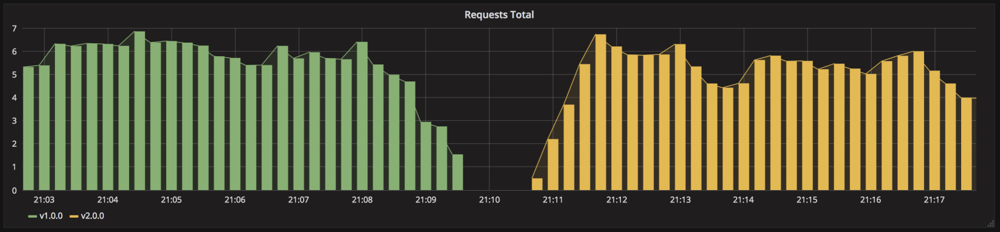
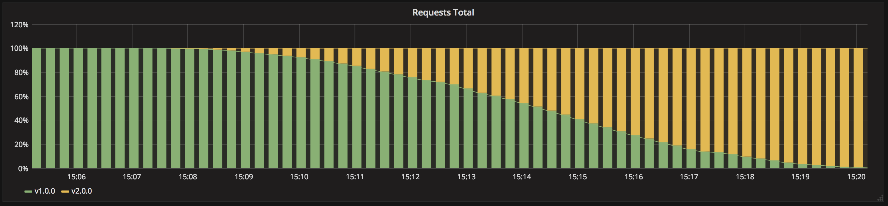

# 從異世界歸來的第十三天 - Kubernetes Deployment Strategies - Rolling Update & Recreate (二)

## 概述

在經過昨天介紹的各種部署策略後，你是不是也跟我一樣對眼花撩亂的名稱豁然開朗，接下來我們就要一口氣練習其中兩種策略，分別是 `Rolling-update` 以及 `Recreate` ，這兩者可以說是在 `Kubernetes` 中是最容易被實現的，因為他們正是資源對象 `Deployment` 中內建來汰換調度`Pod` 的兩種選擇，話不多說就讓我們實際動手玩玩看吧。

## 1. 重建部署策略(Recreate)

重建策略可以說是 `Kubernetes` 最容易實現的一種之一，因為他只要簡單的將 `spec.strategy` 設定為 `Recreate` 即可。定義為`Recreate`的`Deployment`，會終止所有正在運行的實例，然後用較新的版本來重新創建它們，此技術如下圖所示意味著服務的停機時間取決於應用程序的關閉和啟動持續時間，不建議在開發環境中使用。



### 建立 v1 版本應用服務

```python
// app-v1.yaml
apiVersion: apps/v1
kind: Deployment
metadata:
  name: foo-deployment
  labels:
    app: foo
spec:
  replicas: 3
  strategy:
    type: Recreate
  selector:
    matchLabels:
      app: foo
  template:
    metadata:
      labels:
        app: foo
        version: v1
    spec:
      containers:
        - name: foo
          image: mikehsu0618/foo
          ports:
            - containerPort: 8080
```

這裡可以注意到我們利用 `Deployment` 原生支援的部署策略 `spec.strategy.type：Recreate` ，代表我們可以預期當我們更新 `Deployment` 版本或內容時，其將會先將所有 `v1` 版本的 `Pod` 完全關閉後，才會陸續啟動新版本。

讓我們運行其 `v1` 版本的服務：

```python
kubectl apply -f app-v1.yaml
-------
deployment.apps/foo-deployment-v1 created
```

接著我們將額外開啟一個終端機並且使用 `—watch` 來觀察 `Pod` 之間的調度情形：

```python
// 因為 --watch 參數，終端機將會監聽所有來自 Pod 的狀態變化。
kubectl get pods --watch
--------
NAME                                 READY   STATUS             RESTARTS   AGE
foo-deployment-8555547446-ld8fs   1/1     Running             0          8s
foo-deployment-8555547446-nbt2k   1/1     Running             0          9s
foo-deployment-8555547446-w6m5q   1/1     Running             0          13s
```

### 更新 v1 版本至 v2 版本

```python
// app-v2.yaml
apiVersion: apps/v1
kind: Deployment
metadata:
  name: foo-deployment
  labels:
    app: foo
spec:
  replicas: 3
  strategy:
    type: Recreate
  selector:
    matchLabels:
      app: foo
  template:
    metadata:
      labels:
        app: foo
        version: v2
    spec:
      containers:
        - name: foo
          image: mikehsu0618/foo
          ports:
            - containerPort: 8080
```

直接把服務升級到 `v2` 版本：

```python
kubectl apply -f app-v2.yaml
-------
deployment.apps/foo-deployment-v1 created
```

接著回來查看剛剛 `--watch` 監聽的 Pod 情況：

```python

// .....
NAME                                 READY   STATUS             RESTARTS   AGE
foo-deployment-8555547446-ld8fs   1/1     Running             0          8s
foo-deployment-8555547446-nbt2k   1/1     Running             0          9s
foo-deployment-8555547446-w6m5q   1/1     Running             0          13s
foo-deployment-8555547446-nbt2k   1/1     Terminating         0          21s
foo-deployment-8555547446-ld8fs   1/1     Terminating         0          22s
foo-deployment-8555547446-w6m5q   1/1     Terminating         0          22s
foo-deployment-6cbc7db745-vgmmq   0/1     Pending             0          0s
foo-deployment-6cbc7db745-8n6c7   0/1     Pending             0          0s
foo-deployment-6cbc7db745-5t7p6   0/1     Pending             0          0s
foo-deployment-6cbc7db745-8n6c7   0/1     ContainerCreating   0          0s
foo-deployment-6cbc7db745-vgmmq   0/1     ContainerCreating   0          0s
foo-deployment-6cbc7db745-5t7p6   0/1     ContainerCreating   0          1s
foo-deployment-6cbc7db745-8n6c7   1/1     Running             0          6s
foo-deployment-6cbc7db745-5t7p6   1/1     Running             0          8s
foo-deployment-6cbc7db745-vgmmq   1/1     Running             0          12s
```

可以很明確的看到所有的 `Pod` 同時被 `Terminating` 後，才啟動更新後的 `Deployment`的`v2` 版本，沒錯就是如上所示的如此簡單優雅（灑花灑花。

## 2. 滾動部署（Ramped aka. Rolling-update）

滾動部署為 `Kubernetes` 中 `Deployment` 對所有 `Pod` 的預設部署策略，顧名思義為在更新的過程中所有服務不會如同 `recreate` 一樣極端的關閉所有服務，而是如下圖般的小步快跑、細水長流般的平緩更新直到新版本就緒，如果沒有特地聲明將會預設使用滾動更新調度 `Pod`，如需特地聲明可以表示為 `spec.strategy.type：RollingUpdate` ，並且可以設定 `spec.strategy.rollingUpdate.{maxSurge/maxUnavailable}` 來控制服務更新的速率以確保穩定性。



### 建立 v1 版本應用服務

```python
// app-v1.yaml
apiVersion: apps/v1
kind: Deployment
metadata:
  name: foo-deployment
  labels:
    app: foo
spec:
  replicas: 3
  strategy:
    type: RollingUpdate
    rollingUpdate:
      maxSurge: 1
      maxUnavailable: 0
  selector:
    matchLabels:
      app: foo
  template:
    metadata:
      labels:
        app: foo
        version: v1
    spec:
      containers:
        - name: foo
          image: mikehsu0618/foo
          ports:
            - containerPort: 8080
```

在 RollingUpdate 中我們多了一些參數可以來幫我們控制服務更新的速率：

- `spec.strategy.rollingUpdate.maxSurge` ：此數值定義著我們一次最多可以增加多少 `Pod`
- `spec.strategy.rollingUpdate.maxUnavailable` ：表示在滾動更新的過程中，我們可以容忍多少服務停機。

讓我們運行其 `v1` 版本的服務：

```python
kubectl apply -f app-v1.yaml
-------
deployment.apps/foo-deployment configured
```

接著我們將額外開啟一個終端機並且使用 `—watch` 來觀察 `Pod` 之間的調度情形：

```python
kubectl get pods --watch
--------
NAME                              READY   STATUS    RESTARTS   AGE
foo-deployment-8555547446-mrmb8   1/1     Running             0          7s
foo-deployment-8555547446-vwtp4   1/1     Running             0          9s
foo-deployment-8555547446-kg5f7   1/1     Running             0          12s
```

### 更新 v1 版本至 v2 版本

```python
// app-v2.yaml
apiVersion: apps/v1
kind: Deployment
metadata:
  name: foo-deployment
  labels:
    app: foo
spec:
  replicas: 3
  strategy:
    type: RollingUpdate
    rollingUpdate:
      maxSurge: 1
      maxUnavailable: 0
  selector:
    matchLabels:
      app: foo
  template:
    metadata:
      labels:
        app: foo
        version: v2
    spec:
      containers:
        - name: foo
          image: mikehsu0618/foo
          ports:
            - containerPort: 8080
```

直接把服務升級到 `v2` 版本：

```python
kubectl apply -f app-v2.yaml
-------
deployment.apps/foo-deployment configured
```

接著回來查看剛剛 `--watch` 監聽的 Pod 情況：

```python

// .....
NAME                                 READY   STATUS             RESTARTS   AGE
foo-deployment-8555547446-mrmb8   1/1     Running             0          7s
foo-deployment-8555547446-vwtp4   1/1     Running             0          9s
foo-deployment-8555547446-kg5f7   1/1     Running             0          12s
foo-deployment-6cbc7db745-vh8tn   0/1     Pending             0          0s
foo-deployment-6cbc7db745-vh8tn   0/1     ContainerCreating   0          0s
foo-deployment-6cbc7db745-vh8tn   1/1     Running             0          7s
foo-deployment-8555547446-vwtp4   1/1     Terminating         0          104s
foo-deployment-6cbc7db745-crhgt   0/1     Pending             0          0s
foo-deployment-6cbc7db745-crhgt   0/1     ContainerCreating   0          0s
foo-deployment-8555547446-vwtp4   0/1     Terminating         0          105s
foo-deployment-6cbc7db745-crhgt   1/1     Running             0          6s
foo-deployment-8555547446-kg5f7   1/1     Terminating         0          110s
foo-deployment-6cbc7db745-5q5tf   0/1     Pending             0          1s
foo-deployment-6cbc7db745-5q5tf   0/1     ContainerCreating   0          1s
foo-deployment-8555547446-kg5f7   0/1     Terminating         0          111s
foo-deployment-6cbc7db745-5q5tf   1/1     Running             0          5s
foo-deployment-8555547446-mrmb8   1/1     Terminating         0          115s
```

如上我們可以觀察到 `Deployment` 分別同時的運行新服務以及停用舊服務，並且優雅的依照我們設定的速率完成更新。

恭喜各位我們一口氣就實現了兩種部署策略囉～

## 結論

介紹完了最基本的部署策略後，我們將要繼續往下前進到進階策略了(我好興奮啊，在這邊需要讓各位知道部署策略並不是某種特定不互相交集的部署技術，而是由基礎部署策略建立起更細膩的進階設定，且可以同時實現不只一種部署策略，接下來就讓我們期待期待接下來的 `金絲雀部署` 、`藍綠部署`的實戰演練吧。