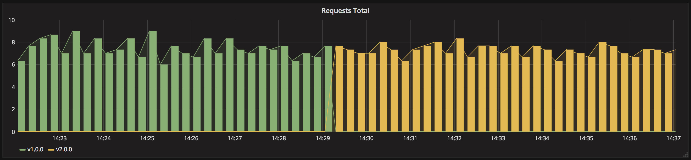

# 從異世界歸來的第十四天 - Kubernetes Deployment Strategies - Blue/Green Deployment 藍綠部署 (三)

## 概述

昨天介紹完了 `Deployment` 兩種最基本的部署策略後，我們接下將要以其為基礎實現的相對進階的部署觀念，在 `Kubernetes` 中指揮調度各種服務是非常容易，這裡也再次呼應只要實現了該策略的精隨就可以算是實現了該策略，並沒有侷限於特定作法，所以在 `Kubernetes` 中我們可以使用像是 `Service` 或是 `Ingress` 等可以管理外部訪問或進行負載均衡的資源對象實作部署策略，今天就讓我們簡單的使用 `Service` 來玩玩最簡單的藍綠部署吧。

## 藍綠部署策略(Blue / Green Deployment)

藍綠部署是最常見的一種 `Zero Downtime` 部署的方式，是相對簡單穩定且不會有多版本同時存在線上的問題，需要注意的是會有一段系統承受兩倍的資源負載的時間，如果資源不吃緊的話的確是值得使用該策略以換取穩定性與時間成本。

以下為藍綠部署新舊版本更新過程中接收流量的示意圖：



## 使用藍綠部署策略更新服務

在 `Kubernetes` 中，我們可以用 `Service` 和 `Ingress` 來實現該策略，實際上的操作關鍵都是在於使用 `label` 標籤去控制流量指向。

大致實現方法可以簡單分為以下步驟：

1. 啟動一個原有的 `v1` 版本服務並且用 `Service` 的 `label selector` 指向該 `v1` 版本服務管理對外端口。
2. 啟動並且等待我們的 `v2` 版本完全就緒，此時新舊兩個版本處於同時存在的狀態。
3. 將 `Service` 的 `label selector` 從 `v1` 版本指向到 `v2` 版本。
4. 確保終止了舊的 `v1` 版本。

大致了解後就馬上來實現吧！

### 實戰練習

```yaml
# app-v1.yaml
apiVersion: apps/v1
kind: Deployment
metadata:
  name: foo-deployment
  labels:
    app: my-app
spec:
  replicas: 3
  selector:
    matchLabels:
      app: my-app
      version: v1
  template:
    metadata:
      labels:
        app: my-app
        version: v1
    spec:
      containers:
        - name: foo
          image: mikehsu0618/foo
          ports:
            - containerPort: 8080
```

```yaml
# service.yaml
apiVersion: v1
kind: Service
metadata:
  name: blue-green-service
spec:
  selector:
    app: my-app
    version: v1
  type: LoadBalancer
  ports:
    - protocol: TCP
      port: 8080
      targetPort: 8080
```

這裡可以注意到我們將 `blue-green-service` 的 `label selector` 與 `v1` 版本互相綁定，使得其可以當作我們對外流量的唯一管理者。

1. 首先把我們的 `v1` 版本及 `service` 都運行起來：

```python
kubectl apply -f app-v1.yaml -f service.yaml
----------
deployment.apps/foo-deployment created
service/blue-green-service created
```

檢查運行狀態：

```bash
kubectl get all
-------
NAME                                  READY   STATUS    RESTARTS   AGE
pod/foo-deployment-68df868866-c99w6   1/1     Running   0          31s
pod/foo-deployment-68df868866-frgkt   1/1     Running   0          31s
pod/foo-deployment-68df868866-npskk   1/1     Running   0          31s

NAME                         TYPE           CLUSTER-IP      EXTERNAL-IP   PORT(S)          AGE
service/blue-green-service   LoadBalancer   10.100.116.42   localhost     8080:30138/TCP   20h
service/kubernetes           ClusterIP      10.96.0.1       <none>        443/TCP          30d

NAME                             READY   UP-TO-DATE   AVAILABLE   AGE
deployment.apps/foo-deployment   3/3     3            3           31s

NAME                                        DESIRED   CURRENT   READY   AGE
replicaset.apps/foo-deployment-68df868866   3         3         3       31s
```

實際請求 `foo` 容器所開放的 API 來確認是是否為 `v1` 版本 ：

```python
curl localhost:8080
--------
{"data":"Hello foo"}%
```

非常的順利，一切如我們所視 `v1` 版本服務已經順利開啟且被 `blue-green-service` 管理外部端口。

1. 接下來預先把要更新的 `v2` 版本也完整啟動起來：

```yaml
＃ app-v2.yaml
apiVersion: apps/v1
kind: Deployment
metadata:
  name: bar-deployment
  labels:
    app: bar
spec:
  replicas: 3
  selector:
    matchLabels:
      app: bar
      version: v1
  template:
    metadata:
      labels:
        app: bar
        version: v1
    spec:
      containers:
        - name: bar
          image: mikehsu0618/bar
          ports:
            - containerPort: 8080
```

預先建立 `v2` 版本服務：

```yaml
kubectl apply -f app-v2.yaml
--------
deployment.apps/bar-deployment created
```

這時再次查看所有服務運作情況：

```yaml
kubectl get all
---------
NAME                                  READY   STATUS    RESTARTS   AGE
pod/bar-deployment-7bbbff5c97-9nq6w   1/1     Running   0          16s
pod/bar-deployment-7bbbff5c97-jp6t2   1/1     Running   0          16s
pod/bar-deployment-7bbbff5c97-qdzl6   1/1     Running   0          16s
pod/foo-deployment-68df868866-c99w6   1/1     Running   0          2m34s
pod/foo-deployment-68df868866-frgkt   1/1     Running   0          2m34s
pod/foo-deployment-68df868866-npskk   1/1     Running   0          2m34s

NAME                         TYPE           CLUSTER-IP      EXTERNAL-IP   PORT(S)          AGE
service/blue-green-service   LoadBalancer   10.100.116.42   localhost     8080:30138/TCP   20h
service/kubernetes           ClusterIP      10.96.0.1       <none>        443/TCP          30d

NAME                             READY   UP-TO-DATE   AVAILABLE   AGE
deployment.apps/bar-deployment   3/3     3            3           16s
deployment.apps/foo-deployment   3/3     3            3           2m34s

NAME                                        DESIRED   CURRENT   READY   AGE
replicaset.apps/bar-deployment-7bbbff5c97   3         3         3       16s
replicaset.apps/foo-deployment-68df868866   3         3         3       2m34s
```

沒錯， `v1` 版本以及 `v2` 版本都已經如我們預期中的同時存在於環境之中。

再打幾次 API 確認環境中依然只開放 `v1` 版本對外：

```yaml
curl localhost:8080
{"data":"Hello foo"}% 
--------                                                                                                                                   
curl localhost:8080
{"data":"Hello foo"}%
--------                                                                                                                                                                                                                                                                       
curl localhost:8080
{"data":"Hello foo"}%    
```

1. 接下來把 `service` 的 `spec.selector` 指向我們的 `v2` 版本：

```yaml
# service.yaml
apiVersion: v1
kind: Service
metadata:
  name: blue-green-service
spec:
  selector:
    app: my-app
    version: v2  // 將 version 從 v1 更新成 v2
  type: LoadBalancer
  ports:
    - protocol: TCP
      port: 8080
      targetPort: 8080
```

再次執行更新過的 `service` 設定檔並且查看詳細資訊

```yaml
kubectl apply -f service.yaml
--------
service/blue-green-service configured

kubectl describe service blue-green-service
------
Name:                     blue-green-servicee
Namespace:                default
Labels:                   <none>
Annotations:              <none>
Selector:                 app=my-app,version=v2
Type:                     LoadBalancer
IP Family Policy:         SingleStack
IP Families:              IPv4
IP:                       10.100.116.42
IPs:                      10.100.116.42
LoadBalancer Ingress:     localhost
Port:                     <unset>  8080/TCP
TargetPort:               8080/TCP
NodePort:                 <unset>  30138/TCP
Endpoints:                10.1.0.136:8080,10.1.0.137:8080,10.1.0.138:8080
Session Affinity:         None
External Traffic Policy:  Cluster
Events:                   <none>
```

成功將 `selector` 更新成 v2 版本～

現在我們可以預期線上環境中只有 `v2` 版本的 `bar`  容器在運行，所以我們將再次發送 API 確認：

```yaml
curl localhost:8080
{"data":"Hello bar"}%
curl localhost:8080
{"data":"Hello bar"}%
curl localhost:8080
{"data":"Hello bar"}%
```

到這裡 `v2` 版本已經確定成功上線囉～

1. 關閉舊的 v1 版本 ：

```yaml
kubectl delete -f app-v1.yaml
--------
deployment.apps "foo-deployment" deleted
```

接下來查看一下線上環境的運作情形：

```yaml
kubectl get all
--------
NAME                                  READY   STATUS    RESTARTS   AGE
pod/bar-deployment-7bbbff5c97-9nq6w   1/1     Running   0          92m
pod/bar-deployment-7bbbff5c97-jp6t2   1/1     Running   0          92m
pod/bar-deployment-7bbbff5c97-qdzl6   1/1     Running   0          92m

NAME                         TYPE           CLUSTER-IP      EXTERNAL-IP   PORT(S)          AGE
service/blue-green-service   LoadBalancer   10.100.116.42   localhost     8080:30138/TCP   21h
service/kubernetes           ClusterIP      10.96.0.1       <none>        443/TCP          30d

NAME                             READY   UP-TO-DATE   AVAILABLE   AGE
deployment.apps/bar-deployment   3/3     3            3           92m

NAME                                        DESIRED   CURRENT   READY   AGE
replicaset.apps/bar-deployment-7bbbff5c97   3         3         3       92m
```

成功的將舊的 `v1` 版本資源都刪除了，到此我們也完成了一次簡單的藍綠部署。

## 結論

終於我們又利用了進階部署策略再一次拯救了我們的線上環境，感謝各位的努力，由上面的簡單範例中我們可以再次印證，只要有心我們可以用各種方法各種工具來實現各種高大尚的技術，最重要的是我們需要將它的觀念內化為自己的語言做到隨心所欲不逾舉的地步。我知道那是你的夢想，也是我的夢想。

相關文章：

- [從異世界歸來的第三天 - Kubernetes 的組件](https://ithelp.ithome.com.tw/articles/10287576)
- [從異世界歸來的第六天 - Kubernetes 三兄弟 - 實戰做一個 Pod (一)](https://ithelp.ithome.com.tw/articles/10288199)
- [從異世界歸來的第八天 - Kubernetes 三兄弟 - 實戰做一個 Deployment (三)](https://ithelp.ithome.com.tw/articles/10288602)

相關程式碼同時收錄在：

[https://github.com/MikeHsu0618/2022-ithelp/tree/master/Day14](https://github.com/MikeHsu0618/2022-ithelp/tree/master/Day14)